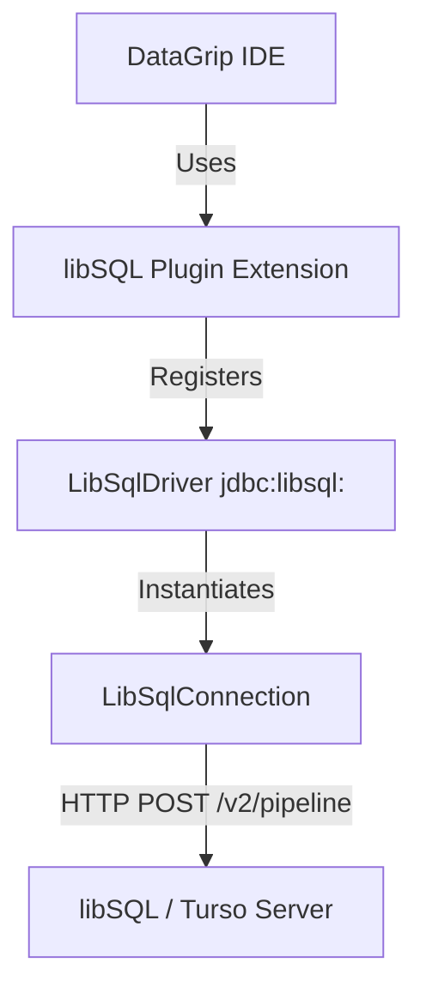

# libSQL / Turso DataGrip JDBC Driver

This project is a native **IntelliJ Platform (DataGrip) Plugin** that bundles a custom **JDBC Driver** for **libSQL** and **Turso** databases. It enables direct, zero-config connectivity via the libSQL HTTP pipeline API (`/v2/pipeline`), bypassing the need for complex native C-bindings or external CLI proxies.

---

## Architecture Overview

---

## Core Components

1. **Plugin Integration (`plugin.xml`, `libsql-drivers.xml`)**
   - Integrates with the `com.intellij.database` module.
   - Registers `LibSqlDriver` as a native driver under the `libSQL / Turso` name.
   - Sets SQL Dialect to **SQLite** (enabling full SQL autocompletion and highlighting).

2. **`LibSqlDriver.java`**
   - Implements `java.sql.Driver`.
   - Parses URLs starting with `jdbc:libsql:`.
   - Extracts authorization tokens from both connection properties (`password`, `authToken`) and URL query parameters (`authToken`, `token`).

3. **`LibSqlConnection.java`**
   - Implements `java.sql.Connection`.
   - Sends query requests as JSON payloads to `/v2/pipeline` using Java's built-in `HttpClient`.
   - Converts standard Java types to libSQL JSON types (e.g. `null`, `integer`, `float`, `text`, `blob`).

4. **`LibSqlStatement.java` & `LibSqlPreparedStatement.java`**
   - Implement query execution wrappers.
   - Handle positional parameters for statements.

5. **`LibSqlResultSet.java` & `LibSqlResultSetMetaData.java`**
   - Wrap the JSON results returned by the libSQL `/v2/pipeline` API.
   - Provide a standard JDBC cursor interface (`next()`, `getString()`, `getInt()`, etc.) over the rows/columns array in the JSON response.

6. **`LibSqlDatabaseMetaData.java`**
   - Implements `java.sql.DatabaseMetaData`.
   - Custom-tailored metadata queries to support schema introspection in DataGrip (listing tables, columns, indexes, primary keys, and foreign keys).
